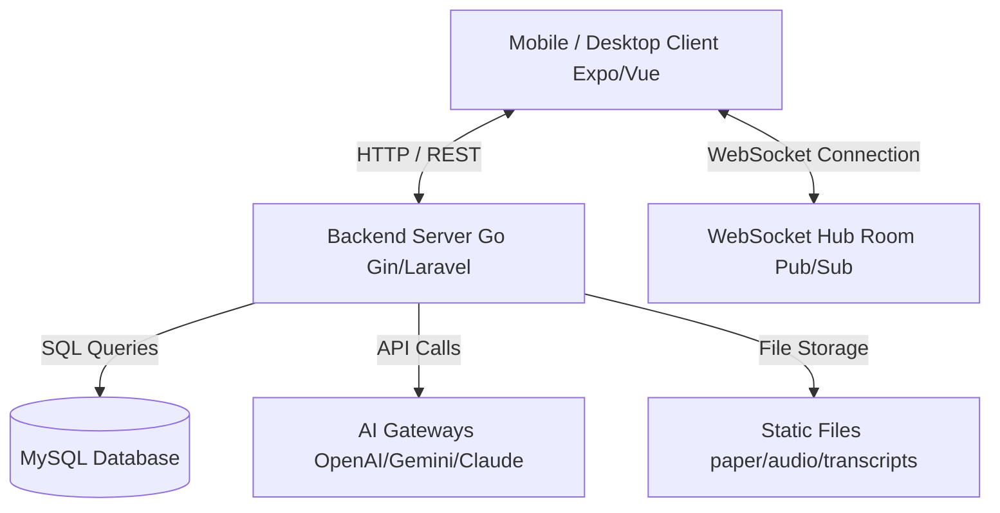

# Project Requirements Document (PRD) — TierLog Platform

This document describes the comprehensive requirements, architecture, database schemas, API endpoints, front-end layout paradigms, UI design tokens, state management systems, and AI integrations for the TierLog thesis supervision platform. It serves as a master blueprint to replicate or align similar projects across different stacks (e.g., Go/Expo React Native Web to Laravel/Vue/Inertia).

---

## 1. System Architecture Overview

TierLog is designed as a high-frequency, real-time interactive platform for thesis bimbingan (supervision) between lecturers and students. The platform leverages speech-to-text transcriptions, AI-driven feedback classification, real-time messaging, and a highly customizable, desktop-like window manager layout.



### Stack Mapping
If replicating the architecture on a PHP/JS stack:
*   **Backend & Router**: Go Gin (Single binary, lightweight router, custom CORS) $\rightarrow$ Laravel (Route declarations, Controller Actions) + Inertia.js (routing web pages without API fetch latency).
*   **Database ORM**: GORM $\rightarrow$ Eloquent ORM.
*   **Real-time Communication**: Go WebSocket Hub (Custom room map using mutexes) $\rightarrow$ Laravel Reverb (or Pusher/Socket.io).
*   **Frontend UI Library**: React Native Web (using NativeWind Tailwind classes) $\rightarrow$ Vue 3 (Composition API) + TailwindCSS.
*   **Global State**: Zustand $\rightarrow$ Pinia.

---

## 2. Database Schema (MySQL)

All tables use strict foreign key constraints with `ON DELETE CASCADE` or `ON DELETE RESTRICT` to enforce data integrity at the database level.

### 2.1 Table: `users`
Represents authentication credentials and individual AI keys.
*   `id`: `bigint unsigned` (Primary Key, Auto Increment)
*   `name`: `varchar(255)` (Not Null)
*   `email`: `varchar(255)` (Unique, Not Null)
*   `password`: `varchar(255)` (Not Null)
*   `role`: `enum('student','lecturer')` (Not Null)
*   `openai_key`: `varchar(255)` (Nullable, Encrypted using AES-GCM)
*   `gemini_key`: `varchar(255)` (Nullable, Encrypted using AES-GCM)
*   `anthropic_key`: `varchar(255)` (Nullable, Encrypted using AES-GCM)
*   `nvidia_key`: `varchar(255)` (Nullable, Encrypted using AES-GCM)
*   `groq_key`: `varchar(255)` (Nullable, Encrypted using AES-GCM)
*   `preferred_model`: `varchar(100)` (Default: `'default'`)
*   `is_gateway_active`: `boolean` (Default: `false`)
*   `created_at`: `datetime(3)`
*   `updated_at`: `datetime(3)`
*   `deleted_at`: `datetime(3)` (Index, Soft Delete)

### 2.2 Table: `refresh_tokens`
Manages user authentication sessions.
*   `id`: `bigint unsigned` (Primary Key, Auto Increment)
*   `user_id`: `bigint unsigned` (Foreign Key $\rightarrow$ `users.id`, `ON DELETE CASCADE`)
*   `token_hash`: `char(64)` (Unique Index, Not Null)
*   `expires_at`: `datetime` (Index, Not Null)
*   `revoked_at`: `datetime` (Nullable)
*   `user_agent`: `varchar(255)`
*   `ip_address`: `varchar(64)`
*   `created_at`: `datetime`
*   `updated_at`: `datetime`

### 2.3 Table: `redeem_codes`
Validates registrations for students under specific classes or lecturers.
*   `id`: `bigint unsigned` (Primary Key, Auto Increment)
*   `code`: `varchar(50)` (Unique, Not Null)
*   `is_used`: `boolean` (Default: `false`)
*   `used_by`: `bigint unsigned` (Nullable, User ID who redeemed it)
*   `created_at`: `datetime`
*   `updated_at`: `datetime`

### 2.4 Table: `lecturers`
Profile for supervisor role.
*   `id`: `bigint unsigned` (Primary Key, Auto Increment)
*   `user_id`: `bigint unsigned` (Foreign Key $\rightarrow$ `users.id`, `ON DELETE CASCADE`)
*   `nip`: `varchar(20)` (Unique, Not Null)
*   `name`: `varchar(100)` (Not Null)
*   `keahlian`: `varchar(100)`
*   `faculty`: `varchar(100)`
*   `ai_constraints`: `text` (System prompt modifications or AI constraints applied by this lecturer)
*   `created_at`: `datetime`
*   `updated_at`: `datetime`

### 2.5 Table: `students`
Profile for supervised role.
*   `id`: `bigint unsigned` (Primary Key, Auto Increment)
*   `user_id`: `bigint unsigned` (Foreign Key $\rightarrow$ `users.id`, `ON DELETE CASCADE`)
*   `lecturer_id`: `bigint unsigned` (Foreign Key $\rightarrow$ `lecturers.id`, `ON DELETE RESTRICT`)
*   `nim`: `varchar(20)` (Unique, Not Null)
*   `name`: `varchar(100)` (Not Null)
*   `prodi`: `varchar(100)`
*   `thesis_title`: `text` (Thesis topic title)
*   `created_at`: `datetime`
*   `updated_at`: `datetime`

### 2.6 Table: `consultation_logs`
Records logs for bimbingan sessions.
*   `id`: `bigint unsigned` (Primary Key, Auto Increment)
*   `student_id`: `bigint unsigned` (Foreign Key $\rightarrow$ `students.id`, `ON DELETE CASCADE`)
*   `audio_filename`: `varchar(255)` (Relative filename of uploaded consultation recording)
*   `transcript_filename`: `varchar(255)` (JSON transcript file path)
*   `transcript_text`: `longtext` (Full voice-to-text string content)
*   `paper_filename`: `varchar(255)` (Draft/thesis paper uploaded during bimbingan)
*   `final_document_filename`: `varchar(255)` (Approved final document)
*   `final_document_uploaded_at`: `datetime`
*   `revised_document_filename`: `varchar(255)` (Revised draft returned by student)
*   `revised_document_uploaded_at`: `datetime`
*   `created_at`: `datetime(3)`
*   `updated_at`: `datetime(3)`
*   `deleted_at`: `datetime(3)`

### 2.7 Table: `feedback_items`
Structured revision items assigned by lecturers to specific consultation logs.
*   `id`: `bigint unsigned` (Primary Key, Auto Increment)
*   `log_id`: `bigint unsigned` (Foreign Key $\rightarrow$ `consultation_logs.id`, `ON DELETE CASCADE`)
*   `content`: `text` (Revision instruction detail)
*   `category`: `enum('Minor','Major')` (Not Null)
*   `status`: `enum('Fixed','Pending','Validated')` (Default: `'Pending'`)
*   `fix_proof_text`: `text` (Explanation by student showing how it was resolved)
*   `created_at`: `datetime(3)`
*   `updated_at`: `datetime(3)`
*   `deleted_at`: `datetime(3)`

### 2.8 Table: `feedback_comments`
Discussion threads on specific feedback items.
*   `id`: `bigint unsigned` (Primary Key, Auto Increment)
*   `feedback_item_id`: `bigint unsigned` (Foreign Key $\rightarrow$ `feedback_items.id`, `ON DELETE CASCADE`)
*   `author_id`: `bigint unsigned` (User ID of commenter)
*   `author_role`: `enum('student','lecturer')`
*   `content`: `text`
*   `created_at`: `datetime`

### 2.9 Table: `direct_messages`
Real-time chat messages between student and lecturer.
*   `id`: `bigint unsigned` (Primary Key, Auto Increment)
*   `log_id`: `bigint unsigned` (Foreign Key $\rightarrow$ `consultation_logs.id`, `ON DELETE CASCADE`)
*   `sender_id`: `bigint unsigned` (User ID of sender)
*   `sender_role`: `enum('student','lecturer')`
*   `content`: `text`
*   `created_at`: `datetime`

### 2.10 Table: `ai_chat_messages`
Conversations with the AI Assistant inside a consultation log.
*   `id`: `bigint unsigned` (Primary Key, Auto Increment)
*   `log_id`: `bigint unsigned` (Foreign Key $\rightarrow$ `consultation_logs.id`, `ON DELETE CASCADE`)
*   `role`: `enum('user','ai')`
*   `content`: `text`
*   `created_at`: `datetime`

### 2.11 Table: `revision_annotations`
Maintains records of annotations made directly inside DOCX files or image captures.
*   `id`: `bigint unsigned` (Primary Key, Auto Increment)
*   `log_id`: `bigint unsigned` (Foreign Key $\rightarrow$ `consultation_logs.id`, `ON DELETE CASCADE`)
*   `filename`: `varchar(255)`
*   `file_type`: `enum('image','docx')`
*   `extracted_text`: `longtext`
*   `created_at`: `datetime`
*   `updated_at`: `datetime`

---

## 3. Backend Endpoints & Security Protocols

All HTTP endpoints use a JWT middleware for authentication, checking the `Authorization: Bearer <token>` header. Rate-limiting is applied to authentication attempts to protect against brute-force attacks.

### 3.1 Authentication & Profile
*   `POST /auth/register`: Register new users. Generates user records; validates students via `redeem_code`.
*   `POST /auth/login`: Authenticate email + password. Returns Access Token (short expiry) + Refresh Token.
*   `POST /auth/refresh`: Swap valid refresh token for a new access token.
*   `POST /auth/logout`: Revoke active refresh token.
*   `GET /auth/me`: Get current authenticated user profile details.
*   `GET /auth/lecturers`: List available lecturers.
*   `PATCH /settings/profile`: Update name, faculty, NIP/NIM details.
*   `PUT /settings/password`: Change account password.

### 3.2 Gateway Settings (AI Model keys)
*   `PATCH /settings/ai-gateway`: Save per-user API keys for Gemini, Claude, Groq, Nvidia, or OpenAI. Keys are stored encrypted using row-level AES-GCM encryption.
*   `POST /settings/ai-gateway/redeem`: Redeems custom promo codes to activate specific AI features.

### 3.3 Dashboard & Log Workflows
*   `GET /dashboard/stats`: Returns statistics (e.g. active student count, validated revisions rate, pending queues).
*   `GET /consultations`: Returns all logs of the active student.
*   `GET /lecturer/consultations`: Returns consultation logs assigned to the lecturer.
*   `GET /lecturer/students`: Returns list of students supervised by the lecturer.
*   `POST /consultations`: Create consultation log. Handles file uploads for audio (`audio_filename`) and papers (`paper_filename`).
*   `GET /download`: Secure download endpoint serving storage files (`/storage/audio/`, `/storage/paper/`, `/storage/revised/`, `/storage/final/`) with authentication validation.
*   `POST /consultations/:id/final-document`: Submit final thesis paper drafts.
*   `POST /consultations/:id/revised-document`: Upload revised document drafts.

### 3.4 Feedback & Communication
*   `POST /consultations/:id/add-feedback`: Lecturer adds a feedback item directly.
*   `PUT /consultations/feedback/:id/status`: Update feedback status (`Pending` $\leftrightarrow$ `Fixed` $\leftrightarrow$ `Validated`). If moving to `Fixed`, student must attach `fix_proof_text`.
*   `POST /consultations/feedback/:id/comments`: Add a comment thread to a specific feedback.
*   `GET /consultations/:id/direct-messages`: Get chat history between student and lecturer.
*   `POST /consultations/:id/direct-messages`: Send message (publishes to WebSocket room).

### 3.5 AI Engine Integrations
*   `POST /consultations/:id/classify-feedback`: Sends transcript text or document revisions to active AI API to split them into structured feedback items.
*   `POST /consultations/check-mismatch`: Verifies if the student's document content is aligned with their assigned thesis topic.
*   `POST /consultations/:id/chat`: Converses with AI Oracle using the session transcripts and thesis paper contents as system context.

### 3.6 WebSocket Server (`/ws`)
Maintains room-based publish/subscribe states for consultation logs.
*   Connect endpoint: `/ws?token=<jwt>`
*   Payload Protocol: JSON message structure:
    ```json
    { "action": "subscribe", "room": "consultation.{log_id}" }
    ```
*   **Published Events**:
    *   `feedback.new`: Emitted when lecturer creates new revision feedback.
    *   `feedback.status-updated`: Emitted when status changes to `Fixed` or `Validated`.
    *   `feedback.comment`: Emitted when a comments thread is updated.
    *   `chat.direct-message`: Emitted when a new chat message is posted.

---

## 4. CSS Design Tokens & Theme Configuration

To replicate the visual aesthetics in TailwindCSS (e.g., Vue + Tailwind), configure the following design tokens:

### 4.1 Colors
*   **Backgrounds (`bg`)**:
    *   `tier-bg`: `#020617` (Deep slate blue-black for primary pages)
    *   `tier-bg-secondary`: `#0F172A` (Slate dark for secondary cards)
    *   `tier-bg-elevated`: `#1E293B` (Lighter slate for floating widgets/dialogs)
    *   `tier-bg-glass`: `rgba(15, 23, 42, 0.8)` (Used with `backdrop-blur-md` or `backdrop-blur-lg`)
*   **Typography (`text`)**:
    *   `tier-text-primary`: `#F8FAFC` (Near-white text for headings)
    *   `tier-text-secondary`: `#94A3B8` (Slate-400 for subtext and body descriptions)
    *   `tier-text-tertiary`: `#64748B` (Slate-500 for timestamps, details, icons)
    *   `tier-text-inverse`: `#020617` (Dark text for white/light elements)
*   **Borders / Dividers (`border` / `divider`)**:
    *   `tier-border-subtle`: `rgba(255, 255, 255, 0.06)` (Ultra-thin borders for cards)
    *   `tier-border-medium`: `rgba(255, 255, 255, 0.15)` (Focus state border outlines)
    *   `tier-divider-light`: `rgba(255, 255, 255, 0.08)` (Separators between list items)
*   **Accents (`accent`)**:
    *   `tier-accent-primary` / `indigo`: `#6366F1` (Main brand color, interactive elements)
    *   `tier-accent-indigo-deep`: `#4F46E5` (Hover states)
    *   `tier-accent-violet`: `#8B5CF6` (AI tags, features)
    *   `tier-accent-rose` / `danger`: `#F43F5E` (Errors, delete actions)
    *   `tier-accent-emerald` / `success`: `#10B981` (Approved / validated revisions)
    *   `tier-accent-amber` / `caution`: `#F59E0B` (Pending items, warnings)
    *   `tier-accent-cyan`: `#06B6D4` (Typing indicators, message streams)

### 4.2 Spacing Grid (4px multiples)
*   `0.5`: `2px` | `1`: `4px` | `2`: `8px` | `3`: `12px` | `4`: `16px` | `5`: `20px` | `6`: `24px` | `8`: `32px` | `12`: `48px` | `16`: `64px`

### 4.3 Typography (SF Pro style scale)
*   `xs`: `12px` (lineHeight: `16px`, letterSpacing: `-0.01em`)
*   `sm`: `14px` (lineHeight: `20px`, letterSpacing: `-0.012em`)
*   `base`: `16px` (lineHeight: `24px`, letterSpacing: `-0.012em`)
*   `lg`: `18px` (lineHeight: `28px`, letterSpacing: `-0.01em`)
*   `xl`: `20px` (lineHeight: `28px`, letterSpacing: `-0.01em`)
*   `2xl`: `24px` (lineHeight: `32px`, letterSpacing: `-0.01em`)

### 4.4 Corner Radius
*   `xs`: `4px` (badges) | `sm`: `8px` (inputs) | `DEFAULT`: `10px` | `base`: `12px` (primary cards) | `md`: `16px` (panel containers) | `full`: `9999px` (pills, buttons)

### 4.5 Elevation & Shadows
*   `shadow-tier-base`: `0 4px 8px -2px rgba(0,0,0,0.3), 0 2px 4px -2px rgba(0,0,0,0.24)`
*   `shadow-tier-glow`: `0 8px 24px -4px rgba(99,102,241,0.18)`
*   `shadow-glass`: `inset 0 1px 1px 0 rgba(255,255,255,0.05), 0 10px 40px -10px rgba(0,0,0,0.5)`

---

## 5. Exhaustive Screen-by-Screen Specifications

Here is a complete breakdown of every screen, its form inputs, layout structure, validation rules, state management, and active frontend flows:

### 5.1 Welcome / Landing Page (`/` / `app/index.tsx`)
*   **Layout Structure**:
    *   A full-page scrollable responsive view. Contains a sticky top Navbar (`h-16`) containing logo, desktop links (Features, How it works, Testimonial, FAQ), and a CTA "Sign In" button.
    *   **Hero Section**: Dynamic background with animated floating color blobs (`FloatingOrbs` component). Renders an eye-catching gradient text header ("AI-Powered Thesis Supervision"), product statistics counters, and direct action triggers.
    *   **Interactive Tabs / Cards**: Renders feature cards (Transcriptions, Mismatch detector, AI Oracle Chat) using scroll reveals.
    *   **Testimonials Slider**: Managed via `activeTestimonial` index state, rendering a fade-in/out text box containing quotes, author, role, and star ratings.
    *   **Accordion FAQ**: Clicking a question toggles `activeFaq` ID state, revealing answers with smooth height transitions.
*   **Redirect Logic**:
    *   If `user` object is present in global authentication state, immediately redirect to `/dashboard` (which will redirect lecturers to `/lecturer-dashboard` or `/workspace`).

### 5.2 Login Page (`/login`)
*   **Layout Structure**:
    *   A centered Glassmorphic Card styled with smooth background gradients, blur effects, and an elegant header.
*   **Form Inputs**:
    *   `email`: Text input. Validated for email format (`user@domain.com`).
    *   `password`: Masked password input with a toggle to show/hide characters.
*   **Validation Rules**:
    *   All inputs are mandatory. Client-side error alerts display if user clicks submit with empty fields.
*   **Operational Flow**:
    *   Sets loading state to block inputs.
    *   Executes `POST /auth/login`. On response:
        *   *Success*: Save JWT access token & refresh token. Redirect based on role (`student` $\rightarrow$ `/dashboard`, `lecturer` $\rightarrow$ `/workspace`).
        *   *Failure*: Render a red alert banner at the top of the form with backend error descriptions.

### 5.3 Registration Page (`/register`)
*   **Layout Structure**:
    *   Centered card matching the Login layout, featuring a slide selector at the top to choose user role: **Student** or **Lecturer**.
*   **Form Inputs (Student Tab)**:
    *   `name`: Text input.
    *   `email`: Email syntax.
    *   `password`: Password string (minimum 6 characters).
    *   `nim`: Text digits.
    *   `prodi`: Study Program dropdown menu.
    *   `lecturer_id`: Supervisor selection (dynamic options fetched from `GET /auth/lecturers` on page load).
    *   `redeem_code`: Text token matching lecturer registration slots.
*   **Form Inputs (Lecturer Tab)**:
    *   `name`: Text input.
    *   `email`: Email syntax.
    *   `password`: Password string.
    *   `nip`: NIP code digits.
    *   `faculty`: Faculty selection dropdown.
*   **Validation Rules**:
    *   All fields required. Email must be unique. Password length checked.
*   **Operational Flow**:
    *   Submits `POST /auth/register`. On error, prints validation flags beneath affected input fields.

### 5.4 Student Dashboard (`/dashboard`)
*   **Layout Structure**:
    *   Responsive layout with top navigation link block. Shows statistics cards followed by a split layout:
        *   *Left Column (60% width)*: Active revision items card listing Major and Minor revisions.
        *   *Right Column (40% width)*: Quick Actions list (Open Consultations, View Past Archives) and AI Oracle assistant widget.
*   **Main Operations**:
    *   **Dashboard Stats**: Fetches from `GET /dashboard/stats` and displays cards containing: Total Guidance Sessions, Pending Revisions, Validated Revisions, Mismatches found.
    *   **Active Revisions Timeline**: Displays a list of revision items. Pending items display a "Mark as Fixed" button.
    *   **Mark as Fixed Form**: Clicking this button opens a modal requesting:
        *   `fix_proof_text`: Description text box (Required).
        *   `revised_document`: File picker to upload corrected file drafts.
        *   Calls `PUT /consultations/feedback/:id/status`, changing status to `Fixed`.
    *   **Comment Drawers**: Clicking comment icons opens a slide-over panel displaying discussion threads. It includes a text editor box that calls `POST /consultations/feedback/:id/comments` to append messages.

### 5.5 Student Consultations Screen (`/consultations`)
*   **Layout Structure**:
    *   Standard margins with a segmented header. The screen is divided into two panels:
        *   *Left Timeline Pane (60%)*: A chronological timeline list of guidance consultation logs.
        *   *Right Chat/Assistant Pane (40%)*: Multi-functional tab bar containing: **Direct Messages** (chat room with advisor) and **AI Oracle Chat** (private AI helper).
*   **Main Operations**:
    1.  **Chronological Timeline**:
        *   Allows creating new sessions via "Upload Guidance Draft".
        *   *Upload Zone*: Takes an audio file (`audio_filename`) and thesis manuscript (`paper_filename`).
            *   On web: uses file inputs that convert files to base64 chunks or native uploads.
            *   On mobile: uses document pickers.
            *   Triggers background transcription worker using dynamic loading circles.
        *   Each timeline item lists dates, audio player widget, paper download link, full transcription text, and annotated images.
    2.  **Direct Chat Pane**:
        *   Scrollable list of messages. Kept at bottom on new message events.
        *   *Typing Indicator*: Displays animated dot pulses when another room member writes.
        *   Sends messages over WebSocket room `consultation.{log_id}` (or POST request fallback).
    3.  **AI Oracle Chat**:
        *   Chat window with the AI assistant. Contains prompt suggestions at the bottom.
        *   Context includes the active consultation log transcript and document data.

### 5.6 Lecturer Dashboard Fallback (`/lecturer-dashboard`)
*   **Layout Structure**:
    *   Standard responsive layout designed for mobile and tablet views. It displays a list of supervised students (left) and details pane (right).
*   **Interactive Flow**:
    *   Lecturers select a student from the directory card.
    *   The details panel loads and displays a segmented switcher with 4 tabs:
        1.  **Overview**: Displays total session statistics, thesis title, NIM, study program, and overall revision progress bars.
        2.  **Revisions**: Displays active revision checklist. Allows validating fixed items or writing comments.
        3.  **Sessions**: Shows consultation log timelines, including transcripts and files.
        4.  **Chat**: Live direct messaging interface connected to WS channels.

### 5.7 Lecturer Workspace Portal (`/workspace`)
*   **Layout Structure**:
    *   Fullscreen sandbox window area beneath a toolbar menu containing: Toggle icons for Roster, History, Feedback Composer, Chat, and Queue, as well as a "Tile Windows" button.
*   **Draggable/Resizable Window Panel Architecture**:
    *   A absolute canvas container taking up `100%` viewport width and height.
    *   Renders active floating windows based on state configs:
        *   `Student Roster Window`: Manage supervised student selections.
        *   `Guidance History Window`: Timeline list of selected student's history logs.
        *   `Dispatch Feedback Window`: Form to type and dispatch new revision instructions to selected student.
        *   `Advisor Chat Window`: Live communication block.
        *   `Validation Queue Window`: Global list of all revisions marked as `Fixed` across all supervised students.
    *   **Interactive Controls**:
        *   *Draggability*: Moving is handled via tracking mouse movements relative to window headers on `onMouseDown` events, updating absolute position `x` and `y` coordinates.
        *   *Resizability*: Corners feature drag handles that recalculate window width `w` and height `h`.
        *   *Z-Index Depth*: Clicking any window element bumps its `zIndex` value to `maxZIndex + 1`, putting it in focus.
        *   *Auto-Tiling*: Clicking "Tile Windows" divides the canvas width evenly by the number of visible panels and sizes them side-by-side.

### 5.8 Settings Sub-pages (`/settings/*`)
*   **Profile Settings (`/settings/profile`)**:
    *   Form inputs: Full Name, study program/faculty, ID number. Submits updates to `PATCH /settings/profile`.
*   **Security Settings (`/settings/security`)**:
    *   Form inputs: Current Password, New Password, Confirm New Password. Submits to `PUT /settings/password`.
*   **AI Gateway Config (`/settings/ai-gateway`)**:
    *   Dropdown to select active AI Provider. Text inputs for API keys: OpenAI Key, Gemini Key, Claude Key, Nvidia Key, Groq Key. Dropdown to select model. Includes toggle switch `is_gateway_active` to switch between personal API keys and lecturer-managed server keys.

### 5.9 Archive Screen (`/archive`)
*   **Layout Structure**:
    *   A detailed data table listing past logs.
*   **Filters**:
    *   Search text input (filters logs by student name or thesis title).
    *   Dropdown for study program and dates.
    *   Action: Downloads past drafts and transcript archives.

---

## 6. Client State Management & Hook Implementations

### 6.1 State Store Design (Zustand / Pinia blueprint)
```typescript
interface PanelState {
  id: string;          // 'roster' | 'history' | 'feedback' | 'chat' | 'queue'
  x: number;           // Absolute X coordinate
  y: number;           // Absolute Y coordinate
  w: number;           // Panel width
  h: number;           // Panel height
  visible: boolean;    // Render toggle
  isMaximized: boolean;// Fullscreen toggle
  zIndex: number;      // Depth level
}

interface WorkspaceState {
  panels: PanelState[];
  selectedStudentId: number | null;
  activeLogId: number | null;
  maxZIndex: number;
  
  // Actions
  togglePanel: (id: string) => void;
  updatePanelPosition: (id: string, x: number, y: number) => void;
  updatePanelSize: (id: string, w: number, h: number) => void;
  maximizePanel: (id: string) => void;
  raisePanel: (id: string) => void;
  tilePanels: (canvasWidth: number, canvasHeight: number) => void;
  setSelectedStudentId: (id: number | null) => void;
}
```

### 6.2 WebSocket Hook (`useWebSocket`) Flow
1.  **Connection**: Opens a WebSocket to `WS_URL` with JWT token on mount.
2.  **Room Subscription**: Send subscription payload on student selection:
    ```json
    { "action": "subscribe", "room": "consultation.{log_id}" }
    ```
3.  **Event Handling Matrix**:
    *   `chat.direct-message` $\rightarrow$ Append message object to active conversation array.
    *   `feedback.status-updated` $\rightarrow$ Map active log feedback items list and modify the affected `status` field.
    *   `feedback.new` $\rightarrow$ Prepend new feedback card to revisions list.
4.  **Auto-Reconnect**: Monitors connection status. Triggers backoff reconnect retry sequence on socket loss.

---

## 7. Multi-Gateway AI Assistance Integration

TierLog uses AI models as active copilots. The system dynamically switches between OpenAI, Anthropic, Gemini, NVIDIA NIM, and Groq depending on API keys provided by the lecturer or student.

### 7.1 Contextual Prompt Scaffolding
*   **Context Ingestion**: The system parses the consultation log (`transcript_text`) and the student's paper draft, packaging them as system messages:
    ```
    System: You are TierLog Oracle. The user is a student. Below is their thesis title, draft document, and their lecturer's voice transcript. Answer questions strictly utilizing this context...
    ```
*   **Lecturer AI Constraints**: Lecturers can set custom rules in `lecturers.ai_constraints` (e.g., "Do not give direct code fixes, only outline logical errors"). This is appended to the system instructions.

### 7.2 Specific AI Operations
1.  **Speech-to-Text Transcription**: Consultation voice recordings are parsed by Whisper/Gemini APIs to output full text logs.
2.  **Automatic Feedback Parsing & Classification**: Parses the raw transcription text to identify specific instructions, outputs them as JSON arrays, and saves them directly as `FeedbackItem` rows:
    ```json
    [
      { "content": "Revise the research methodology section to explain sample size calculation", "category": "Major" },
      { "content": "Correct typos on bibliography formatting", "category": "Minor" }
    ]
    ```
3.  **Title Mismatch Verification**: Evaluates whether the uploaded draft document contents diverge from the student's registered thesis topic.
4.  **Annotations Extractor**: Scans images or word documents containing revisions (via OCR or XML extraction) to catalog feedback item logs automatically.

---

## 8. Step-by-Step Laravel / Vue Replication Guide

To replicate TierLog functionality on a Laravel + Vue + Inertia stack:

### Step 1: Eloquent Database Migrations
*   Build migrations matching the schemas in **Section 2**. Ensure correct relational bindings (`onDelete('cascade')`).
*   Implement password hashing using bcrypt/Argon2.
*   Build User model with encrypted columns for AI keys (`gemini_key`, `openai_key`, etc.) utilizing Laravel's built-in cast encryption (`encrypted`).

### Step 2: Laravel WebSocket Configuration
*   Configure Laravel Reverb (or Pusher/Socket.io).
*   Establish channel routing: Private channel `consultation.{logId}`.
*   Build events: `FeedbackDispatched`, `FeedbackStatusChanged`, `CommentPosted`, `NewDirectMessage` that broadcast to Reverb.

### Step 3: API Endpoints (Controller Logic)
*   Build controllers for Auth, Consultation logs, Feedback items, and Chat logs.
*   Implement JWT-based API login or Laravel Sanctum token guards.
*   Implement multipart file upload handlers (supporting audio files and documents). Constrain limits to 20MB in php.ini.

### Step 4: AI Gateway Integration
*   Integrate AI packages (e.g., Gemini PHP SDK, OpenAI PHP client).
*   Create a service class to dynamically instantiate AI connections based on keys stored in the authenticated user's record.
*   Build prompts to classify transcripts into JSON feedback items.

### Step 5: Vue 3 Layouts & State (Pinia)
*   Configure Pinia store (`useWorkspaceStore`) to manage:
    *   Active `panels` layout states (`x`, `y`, `w`, `h`, `visible`, `isMaximized`, `zIndex`).
    *   Selected student information.
*   Build the Workspace Layout container with relative bounds, tracking layout size changes.
*   Implement dragging (`@mousedown`) and resizing handles inside a Vue window component.
*   Wire up Laravel Echo/Pusher hooks in the Vue setup script to update direct messages and validation lists in real time.
