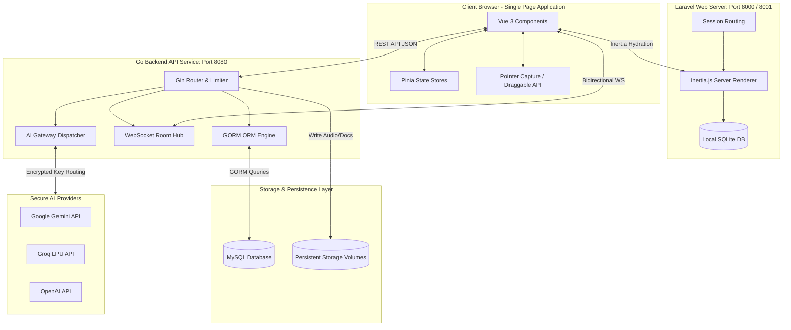

# 🛡️ TierLog — Enterprise Intelligent Thesis Supervision Platform

[](https://github.com/cruzhgggggg-coder/TIERLOG_FRONT_BACK_AI.git)
[-amber?style=for-the-badge)](https://github.com/cruzhgggggg-coder/TIERLOG_FRONT_BACK_AI.git)
[](https://github.com/cruzhgggggg-coder/TIERLOG_FRONT_BACK_AI.git)

TierLog is a high-performance, real-time thesis supervision (bimbingan) and revision tracker. By combining a split-service architecture—a highly concurrent **Go (Gin Gonic) Backend** and a reactive **Laravel + Inertia.js (Vue 3, Pinia, TypeScript, Tailwind CSS v4) Frontend**—TierLog delivers a desktop-like workflow with low latency, robust data protection, and a highly customizable workspace.

---

## 📋 Table of Contents
- [1. Technical Architecture & Design Patterns](#1-technical-architecture--design-patterns)
- [2. Enterprise Security & Guardrails](#2-enterprise-security--guardrails)
- [3. Project Directory structure](#3-project-directory-structure)
- [4. Complete Database Schema (MySQL & SQLite)](#4-complete-database-schema-mysql--sqlite)
- [5. API & WebSocket Specifications (Contract Docs)](#5-api--websocket-specifications-contract-docs)
- [6. Frontend Floating Window Workspace Engine](#6-frontend-floating-window-workspace-engine)
- [7. Installation & Deployment Guide](#7-installation--deployment-guide)
- [8. Production Deployment & Scaling Guidelines](#8-production-deployment--scaling-guidelines)

---

## 1. Technical Architecture & Design Patterns

TierLog utilizes a dual-engine structure optimized for speed, reliability, and ease of deployment:



### Key Architectural Patterns
*   **The Backend (Go)**: Built with Gin Gonic, focusing on raw HTTP throughput, real-time WebSocket room piping, and thread-safe operations. GORM is utilized for connection pooling and schema migrations.
*   **The Frontend (Laravel + Inertia.js + Vue 3)**: Laravel acts as the initial page renderer and state-dehydrator. Inertia.js eliminates the latency of fetching page files dynamically, combining the security and routing properties of Laravel with the single-page application (SPA) reactive runtime of Vue 3.
*   **Decoupled State Management**:
    - **Authentication**: Managed via the Pinia `auth` store with local storage synchronization and automatic JWT expiry checks.
    - **Workspace State**: Coordinates, maximization, focus depth (z-index), and visibility configurations are managed dynamically within `workspace` Pinia store.

---

## 2. Enterprise Security & Guardrails

TierLog enforces strict security compliance at all levels of the application:

### 2.1 Encryption-At-Rest (AI Gateways)
To allow students and lecturers to use their own AI resources without exposing them, individual API keys (OpenAI, Gemini, Groq, Anthropic, Nvidia) are saved in the database under the `users` table. 
- **Encryption**: Keys are encrypted using **AES-256-GCM** row-level encryption. The decryption key is loaded strictly in the Go backend container RAM via environment variables.
- **Graceful Failures**: If no keys are provided, features degrading to AI support are blocked gracefully and dashboard widgets display warnings without causing server or client-side runtime errors.

### 2.2 AI Prompt Guardrails & Constraints
AI features (such as feedback classification and bimbingan help) operate under strict prompt boundaries:
1.  **Strict Contextual Bounding**: The AI assistant *cannot* invent advice. It strictly operates within the context of the official lecturer's feedback database logs.
2.  **Lecturer Constraints Injection**: Lecturers can save a custom system prompt guideline (`ai_constraints`). These guidelines are fetched and dynamically appended to the AI system prompt before dispatching queries to external LLMs, ensuring the AI aligns with the lecturer's teaching methodology.

### 2.3 Rate Limiting
To prevent brute-force attacks and abuse, the Go backend incorporates a Token Bucket rate-limiter middleware:
- **General Rate Limit**: Capped at 100 requests per minute per IP.
- **Sensitive Operations**: Registration (5 requests/min), Login (10 requests/min), and Token Refresh (20 requests/min).

---

## 3. Project Directory Structure

```
PopularProgramingFinalProject/
├── controller/                 # Go Controllers (REST Handlers)
│   ├── ai_controller.go        # Handles AI Gateway queries, key validations, and prompts
│   ├── app_controller.go       # Auth token refresh, profiles, and dashboard statistics
│   ├── consultation_controller.go# Audio/docx uploads, feedback status, and direct messages
│   └── user_controller.go      # Student/Lecturer account generation
├── models/                     # Go Database Models
│   └── models.go               # GORM model structs with JSON tags
├── koneksi/                    # Database Setup
│   └── koneksi.go              # Database connection pool settings and auto-migration
├── middleware/                 # Go HTTP Middlewares
│   └── middleware.go           # JWT Auth, CORS setup, Rate limiters, and Role checkers
├── realtime/                   # WebSockets Engine
│   └── websocket.go            # Room subscriber hub matching client channels
├── storage/                    # Local Disk Assets (Ignored in Git, mounted in volumes)
│   ├── audio/                  # .mp3 voice supervision recordings
│   ├── paper/                  # .docx draft thesis papers
│   ├── transcript/             # JSON-based transcript and audio timestamps
│   ├── annotations/            # Extracted docx annotations and text dumps
│   └── final/                  # Approved final drafts
├── tierlog_web/                # Frontend Application (Laravel & Inertia)
│   ├── app/                    # Laravel controllers & middlewares
│   ├── config/                 # Config files (auth.php, app.php, database.php)
│   ├── database/               # Database definitions (SQLite layout)
│   ├── routes/
│   │   └── web.php             # SPA web page Inertia routes
│   ├── resources/js/           # Vue 3 SPA Files
│   │   ├── components/         # Reusable UI widgets (WorkspaceWindow, UiField, UiBadge, etc.)
│   │   ├── pages/              # Vue page templates (Workspace, Consultations, Login, etc.)
│   │   ├── stores/             # Pinia state managers (auth.ts, workspace.ts)
│   │   ├── types.ts            # Type declarations for API contracts
│   │   └── app.ts              # Vite entrypoint loading Vue, Pinia, & Inertia
│   ├── tailwind.config.js      # Tailwind CSS configuration
│   ├── tsconfig.json           # TypeScript compilation config
│   ├── vite.config.js          # Vite assets compiler
│   └── Dockerfile              # Frontend multi-stage build container
├── Dockerfile                  # Go API Dockerfile
├── docker-compose.yml          # Container configuration orchestrator
├── struct_go.sql               # Database layout structure
└── README.md                   # System Documentation
```

---

## 4. Complete Database Schema (MySQL & SQLite)

The platform relies on **MySQL** for data records, logs, real-time messaging, and key persistence. **SQLite** is configured on the frontend to manage Laravel session metadata.

### MySQL Database Tables (`struct_go` DB)

```
  ┌──────────────┐          ┌──────────────┐          ┌──────────────┐
  │    users     │1       1 │  lecturers   │1       * │   students   │
  │  (Accounts)  ├──────────┤   (Profiles) ├──────────┤   (Profiles) │
  └──────┬───────┘          └──────────────┘          └──────┬───────┘
         │1                                                  │1
         │                                                   │
         │*                                                  │*
  ┌──────┴───────┐                                    ┌──────┴───────┐
  │refresh_tokens│                                    │consultation_ │
  │  (Sessions)  │                                    │     logs     │
  └──────────────┘                                    └──────┬───────┘
                                                             │1
                                              ┌──────────────┼──────────────┐
                                             *│             *│             *│
                                      ┌──────┴───────┐┌──────┴───────┐┌──────┴───────┐
                                      │feedback_items││direct_msgs   ││ai_chat_msgs  │
                                      │ (Revisions)  ││ (Room Chats) ││(AI Assistant)│
                                      └──────┬───────┘└──────────────┘└──────────────┘
                                             │1
                                             │*
                                      ┌──────┴───────┐
                                      │feedback_     │
                                      │comments      │
                                      └──────────────┘
```

#### 4.1 Table: `users`
Represents credentials and user-defined API keys:
- `id` (`bigint unsigned`, PK, Auto Increment)
- `name` (`varchar(255)`, Not Null)
- `email` (`varchar(255)`, Unique, Index, Not Null)
- `password` (`varchar(255)`, Not Null)
- `role` (`enum('student','lecturer')`, Not Null)
- `openai_key`, `gemini_key`, `anthropic_key`, `nvidia_key`, `groq_key` (`varchar(255)`, Nullable, Encrypted)
- `preferred_model` (`varchar(100)`, Default: `'default'`)
- `is_gateway_active` (`boolean`, Default: `false`)
- `created_at`, `updated_at`, `deleted_at` (`datetime`)

#### 4.2 Table: `lecturers`
Profile schema for the supervisor:
- `id` (`bigint unsigned`, PK, Auto Increment)
- `user_id` (`bigint unsigned`, FK $\rightarrow$ `users.id`, Cascade)
- `nip` (`varchar(20)`, Unique, Index, Not Null)
- `name` (`varchar(100)`, Not Null)
- `keahlian` (`varchar(100)`)
- `faculty` (`varchar(100)`)
- `ai_constraints` (`text`, Nullable) - System guidelines loaded for the AI
- `created_at`, `updated_at` (`datetime`)

#### 4.3 Table: `students`
Profile schema for supervised students:
- `id` (`bigint unsigned`, PK, Auto Increment)
- `user_id` (`bigint unsigned`, FK $\rightarrow$ `users.id`, Cascade)
- `lecturer_id` (`bigint unsigned`, FK $\rightarrow$ `lecturers.id`, Restrict)
- `nim` (`varchar(20)`, Unique, Index, Not Null)
- `name` (`varchar(100)`, Not Null)
- `prodi` (`varchar(100)`)
- `thesis_title` (`text`)
- `created_at`, `updated_at` (`datetime`)

#### 4.4 Table: `consultation_logs`
Supervision session logs:
- `id` (`bigint unsigned`, PK, Auto Increment)
- `student_id` (`bigint unsigned`, FK $\rightarrow$ `students.id`, Cascade, Index)
- `audio_filename` (`varchar(255)`, Nullable)
- `transcript_filename` (`varchar(255)`, Nullable)
- `transcript_text` (`longtext`, Nullable)
- `paper_filename` (`varchar(255)`, Nullable)
- `final_document_filename` (`varchar(255)`, Nullable)
- `final_document_uploaded_at` (`datetime`, Nullable)
- `revised_document_filename` (`varchar(255)`, Nullable)
- `revised_document_uploaded_at` (`datetime`, Nullable)
- `created_at`, `updated_at` (`datetime`)

#### 4.5 Table: `feedback_items`
Revision tasks requested by lecturers:
- `id` (`bigint unsigned`, PK, Auto Increment)
- `log_id` (`bigint unsigned`, FK $\rightarrow$ `consultation_logs.id`, Cascade, Index)
- `content` (`text`, Not Null)
- `category` (`enum('Minor','Major')`, Not Null)
- `status` (`enum('Fixed','Pending','Validated','Rejected')`, Default: `'Pending'`, Index)
- `fix_proof_text` (`text`, Nullable) - Submitted by student during revision fix
- `created_at`, `updated_at` (`datetime`)

#### 4.6 Table: `direct_messages`
Real-time messaging logs:
- `id` (`bigint unsigned`, PK, Auto Increment)
- `log_id` (`bigint unsigned`, FK $\rightarrow$ `consultation_logs.id`, Cascade, Index)
- `sender_id` (`bigint unsigned`, FK $\rightarrow$ `users.id`, Cascade)
- `sender_role` (`enum('student','lecturer')`, Not Null)
- `content` (`text`, Not Null)
- `created_at` (`datetime`)

---

## 5. API & WebSocket Specifications (Contract Docs)

### 5.1 Registration & Authentication
#### **POST** `/auth/register`
- **Body**:
  ```json
  {
    "name": "Budi Mahasiswa",
    "email": "student@university.ac.id",
    "password": "securepassword",
    "role": "student",
    "nim": "2200010001",
    "prodi": "Informatika",
    "redeem_code": "LEC-CODE-12"
  }
  ```
- **Response (`201 Created`)**:
  ```json
  {
    "message": "User registered successfully",
    "access_token": "eyJhbGciOi...",
    "refresh_token": "d8a1f4...",
    "user": { "id": 1, "name": "Budi Mahasiswa", "role": "student" }
  }
  ```

#### **POST** `/auth/login`
- **Body**:
  ```json
  {
    "email": "dosen@university.ac.id",
    "password": "securepassword"
  }
  ```
- **Response (`200 OK`)**:
  ```json
  {
    "access_token": "eyJhbGciOi...",
    "refresh_token": "d8a1f4...",
    "user": {
      "id": 2,
      "name": "Dr. Dosen",
      "role": "lecturer",
      "lecturer": { "nip": "1980...", "ai_constraints": "" }
    }
  }
  ```

---

### 5.2 Profile & Constraints Management
#### **PATCH** `/settings/profile`
- **Auth Required**: JWT Token
- **Body (for Lecturer)**:
  ```json
  {
    "name": "Dr. Dosen, M.T.",
    "email": "dosen@university.ac.id",
    "nip": "198001012005011001",
    "faculty": "Informatika",
    "keahlian": "Software Engineering",
    "ai_constraints": "AI harus fokus menyarankan perbaikan metodologi dan menolak mengoreksi format dokumen."
  }
  ```
- **Response (`200 OK`)**:
  ```json
  {
    "message": "Profile updated successfully",
    "user": {
      "id": 2,
      "name": "Dr. Dosen, M.T.",
      "role": "lecturer",
      "lecturer": {
        "nip": "198001012005011001",
        "faculty": "Informatika",
        "keahlian": "Software Engineering",
        "ai_constraints": "AI harus fokus menyarankan perbaikan metodologi..."
      }
    }
  }
  ```

---

### 5.3 Consultation Log & Upload Workflow
#### **POST** `/consultations`
- **Auth Required**: Student Role
- **Content-Type**: `multipart/form-data`
- **Payload**:
  - `audio` (Binary File, `.mp3`/`.wav`)
  - `paper` (Binary File, `.docx`)
- **Response (`201 Created`)**:
  ```json
  {
    "message": "Consultation log and AI feedback created successfully",
    "data": {
      "id": 12,
      "student_id": 1,
      "audio_filename": "177621_recording.mp3",
      "transcript_text": "Metodologi menggunakan Agile, perbaiki diagram...",
      "paper_filename": "177621_thesis.docx",
      "feedback_items": [
        { "id": 5, "content": "Perbaiki diagram Agile di Bab 3", "category": "Major", "status": "Pending" }
      ]
    }
  }
  ```

---

### 5.4 Real-time WebSocket Protocol
Connections are established at `ws://localhost:8080/ws?token=<token>`.

#### 1. Subscribe to Room (Client-side)
Clients are automatically pooled into a room based on the active consultation log id:
```javascript
// Connection payload triggers subscription
socket.send(JSON.stringify({
  action: "subscribe",
  room: "consultation.12"
}));
```

#### 2. Send Message Event (Bidirectional)
Client sends a direct chat message to the room:
```json
{
  "action": "send_message",
  "room": "consultation.12",
  "content": "Pak, saya sudah mengunggah revisi terbaru untuk diagram Bab 3."
}
```
Go WebSocket server broadcasts the message object to all listening devices in the room:
```json
{
  "event": "chat_message",
  "data": {
    "id": 104,
    "log_id": 12,
    "sender_id": 1,
    "sender_role": "student",
    "content": "Pak, saya sudah mengunggah revisi terbaru...",
    "created_at": "2026-06-21T11:45:00Z"
  }
}
```

---

## 6. Frontend Floating Window Workspace Engine

The portal at `/workspace` contains a draggable, resizable multi-window workspace. It uses pointer events for smooth dragging and resizing and manages window depths reactively.

```
┌───────────────────────────────── Workspace Canvas ────────────────────────────────┐
│  [ Roster ]   [ History ]   [ Feedback ]   [ Chat ]   [ Queue ]     [ Tile Windows ]│
├───────────────────────────────────────────────────────────────────────────────────┤
│                                                                                   │
│  ┌── Student Roster ──┐          ┌────── Direct Chat ──────┐                      │
│  │ 👤 Budi Mahasiswa  │          │ (Dosen) : Silakan       │                      │
│  │ 👤 Ani Lestari     │          │ (Mhs)   : Baik Pak.     │                      │
│  │                    │          │                         │                      │
│  └────────────────────┘          │ ┌─────────────────────┐ │                      │
│                                  │ │ Type a message...   │ │                      │
│                                  │ └─────────────────────┘ │                      │
│                                  └─────────────────────────┘                      │
│                                                                                   │
└───────────────────────────────────────────────────────────────────────────────────┘
```

### Dragging Mechanics (`WorkspaceWindow.vue`)
The pointer position is bound dynamically relative to the sandbox canvas:
```typescript
function onHeaderPointerDown(e: PointerEvent) {
  if ((e.target as HTMLElement).closest('.window-btn')) return;
  emit('focus'); // Elevate z-index

  isDragging.value = true;
  startX = props.x;
  startY = props.y;
  startPageX = e.pageX;
  startPageY = e.pageY;

  (e.target as HTMLElement).setPointerCapture(e.pointerId);
}

function onHeaderPointerMove(e: PointerEvent) {
  if (!isDragging.value) return;
  const dx = e.pageX - startPageX;
  const dy = e.pageY - startPageY;

  // Enforce boundary logic
  const newX = Math.max(0, startX + dx);
  const newY = Math.max(0, startY + dy);

  emit('update:position', { x: newX, y: newY });
}
```

---

## 7. Installation & Deployment Guide

Follow these steps to deploy TierLog for development or production environments:

### 7.1 Manual Local Setup

#### Step 1: Backend Setup (Go)
1.  Clone this repository.
2.  Duplicate `.env.example` as `.env` in the root folder and configure:
    ```env
    DB_HOST=127.0.0.1
    DB_PORT=3306
    DB_DATABASE=struct_go
    DB_USERNAME=root
    DB_PASSWORD=
    JWT_SECRET=your_super_secret_jwt_key
    ```
3.  Run Go build:
    ```bash
    go mod tidy
    go run main.go
    ```
    *The Go API backend will start listening at `http://localhost:8080`.*

#### Step 2: Frontend Setup (Laravel + Inertia)
1.  Navigate to the web client folder:
    ```bash
    cd tierlog_web
    ```
2.  Install composer and npm dependencies:
    ```bash
    composer install
    npm install
    ```
3.  Duplicate `.env.example` as `.env` and set SQLite database:
    ```env
    DB_CONNECTION=sqlite
    VITE_API_URL=http://localhost:8080
    ```
4.  Initialize the SQLite database file:
    ```bash
    copy NUL database\database.sqlite   # On Windows CMD
    # Or PowerShell: New-Item database/database.sqlite -ItemType File
    php artisan migrate --force
    ```
5.  Launch development server and Vite assets bundler:
    ```bash
    npm run dev
    # In another terminal tab:
    php artisan serve --port=8000
    ```
    *Access the main page via `http://localhost:8000`.*

---

## 7.2 Docker Deployment (Automated)

The entire multi-container service (MySQL database, Go backend, and Laravel web client) can be run using Docker Compose.

```bash
# Clone the repository
git clone https://github.com/cruzhgggggg-coder/TIERLOG_FRONT_BACK_AI.git
cd TIERLOG_FRONT_BACK_AI

# Build and start services
docker-compose up --build -d
```

Docker Compose spins up the following services:
- **`tierlog-db`** (Port `3306`): MySQL database running on `mysql:8.0`.
- **`tierlog-go-api`** (Port `8080`): Compiles Go binary on `golang:alpine` and mounts storage volumes.
- **`tierlog-laravel-web`** (Port `8001`): Compiles Node Vite assets dynamically passing `VITE_API_URL` as a build argument (`args`), configures PHP 8.4 Apache runtime, and deploys it on Port `8001`.

---

## 8. Production Deployment & Scaling Guidelines

To scale the TierLog platform in production, consider the following recommendations:

### 8.1 Reverse Proxy Setup (Nginx)
Configure Nginx to act as a reverse proxy to route frontend page requests, API requests, and WebSocket connections safely under a single domain using TLS:

```nginx
server {
    listen 443 ssl http2;
    server_name tierlog.university.ac.id;

    ssl_certificate /etc/letsencrypt/live/tierlog/fullchain.pem;
    ssl_certificate_key /etc/letsencrypt/live/tierlog/privkey.pem;

    # Frontend Assets and Laravel Server
    location / {
        proxy_pass http://127.0.0.1:8001;
        proxy_set_header Host $host;
        proxy_set_header X-Real-IP $remote_addr;
        proxy_set_header X-Forwarded-For $proxy_add_x_forwarded_for;
        proxy_set_header X-Forwarded-Proto $scheme;
    }

    # Go API Endpoints
    location /api/ {
        proxy_pass http://127.0.0.1:8080;
        proxy_set_header Host $host;
        proxy_set_header X-Real-IP $remote_addr;
        proxy_set_header X-Forwarded-For $proxy_add_x_forwarded_for;
        proxy_set_header X-Forwarded-Proto $scheme;
    }

    # WebSocket Upgrade Route
    location /ws {
        proxy_pass http://127.0.0.1:8080;
        proxy_http_version 1.1;
        proxy_set_header Upgrade $http_upgrade;
        proxy_set_header Connection "upgrade";
        proxy_set_header Host $host;
        proxy_set_header X-Real-IP $remote_addr;
        proxy_set_header X-Forwarded-For $proxy_add_x_forwarded_for;
    }
}
```

### 8.2 Persistent Volumes for Media Storage
Because consultation logs contain heavy media assets (voice recording `.mp3` files can be up to 50MB each), ensure the `/app/storage` folder is mounted on high-speed network storage (e.g., AWS EFS, Google Cloud Filestore, or standard block volumes) rather than temporary local container storage.

### 8.3 Redis Integration for Real-time Scaling
In a multi-instance container cluster, the default in-memory WebSocket Room Hub map (which tracks connections via Geth mutexes) must be scaled. Replace the memory map in `realtime/websocket.go` with a **Redis Pub/Sub adapter** to sync chat messages and status updates across multiple API containers.

---

*TierLog — Secure, fast, and intelligent supervision platform.*
