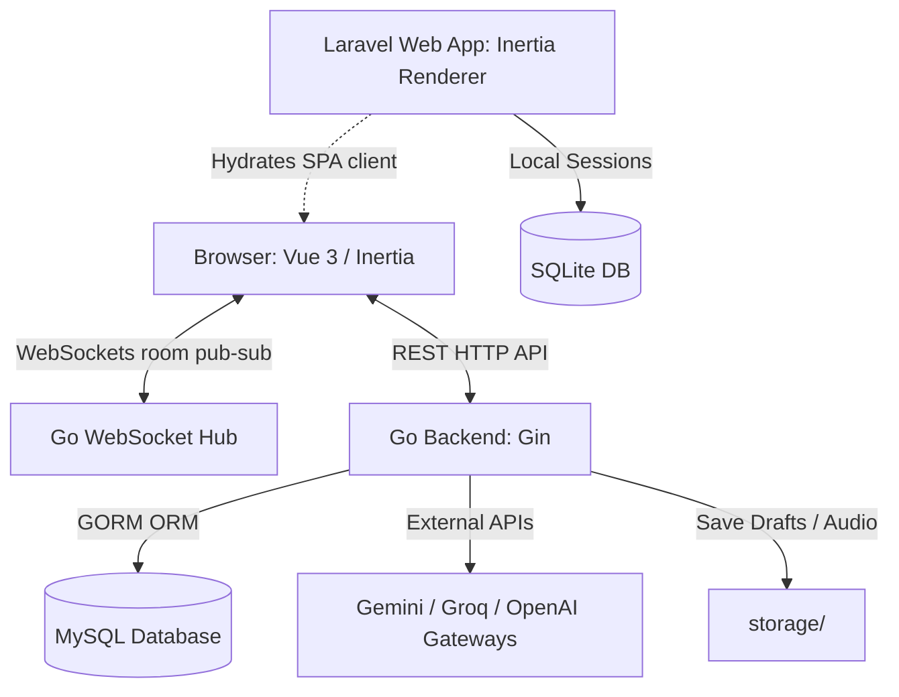

# 🛡️ TierLog — Intelligent Thesis Supervision System

> **AI-Powered E-Logbook, Real-time Chat, and Floating Workspace Portal**
>
> A secure, real-time bridge connecting lecturers and students to accelerate thesis supervision (bimbingan).
> Built on a high-performance hybrid stack: **Go (Gin Gonic, GORM, WebSockets) Backend** & **Laravel + Inertia.js (Vue 3, Pinia, TypeScript, Tailwind CSS v4) Frontend**.

---

## 📋 Table of Contents
- [✨ Core Features](#-core-features)
- [🏗️ System Architecture](#-system-architecture)
- [📂 Folder Structure](#-folder-structure)
- [🗄️ Database Schemas](#-database-schemas)
- [📡 API & WebSocket Reference](#-api--websocket-reference)
- [🖥️ Frontend Workspace Architecture](#-frontend-workspace-architecture)
- [🚀 Quick Start (Local Development)](#-quick-start-local-development)
- [🐳 Docker Deployment](#-docker-deployment)
- [⚠️ Troubleshooting & Best Practices](#-troubleshooting--best-practices)

---

## ✨ Core Features

- **Draggable & Resizable Workspace Portal (`/workspace`)**: A premium desktop-like window manager layout for lecturers with 5 dynamically loaded floating panels (Student Roster, History Timeline, Feedback Composer, Direct Messages, and Validation Queue) with automated grid tiling.
- **WebSocket Synchronization**: Room-based pub/sub for real-time messaging, status validations, and log updates.
- **Multi-Format Logbook**: Attach consultation recordings (`.mp3`), drafts (`.docx`), and annotations.
- **AI-Guarded Engine**: Support for multiple AI providers (Gemini, Groq, Anthropic, Nvidia, OpenAI) to perform transcript parsing, mismatch checking, and revision support.
- **Lecturer AI Constraints Settings**: Textarea settings where lecturers can modify the AI's instructions (e.g., *"Focus on methodological logic rather than formatting"*).
- **Graceful Key Handlers**: Key fields (OpenAI, Gemini, etc.) are student-centric and completely optional; the system runs cleanly even with empty keys.

---

## 🏗️ System Architecture

TierLog uses a split client-server model optimized for performance and real-time synchronization:



---

## 📂 Folder Structure

```
PopularProgramingFinalProject/
├── controller/            # Go Backend Controllers
│   ├── ai_controller.go           # AI Gateway APIs & Prompt Guardrails
│   ├── app_controller.go          # Profile, Authentication, & Dashboard APIs
│   ├── consultation_controller.go # File uploads, logs & revision annotations
│   └── user_controller.go         # User list & code generation
├── models/                # Go Backend Structs & DB Definitions
│   └── models.go                  # GORM models & JSON mappings
├── koneksi/               # Go DB Connection setup
│   └── koneksi.go                 # MySQL DSN binding & AutoMigrate index setup
├── middleware/            # Go Auth & Access Limiters
│   └── middleware.go              # JWT Validator, Rate-limiter, & Role checking
├── realtime/              # Go WebSocket Engine
│   └── websocket.go               # Room mapping, mutexes, & client socket handling
├── storage/               # File Assets Directory (Excluded from Git)
│   ├── audio/                     # Consultation recording mp3s
│   ├── paper/                     # Student docx drafts
│   ├── transcript/                # JSON transcript and text files
│   └── final/                     # Approved final thesis drafts
├── tierlog_web/           # Frontend Web Application (Laravel & Vue 3 SPA)
│   ├── app/                       # Laravel Controllers & Http Middlewares
│   ├── config/                    # Laravel Configuration
│   ├── routes/
│   │   └── web.php                # Inertia Routing Definitions
│   ├── resources/js/              # Vue 3 App root
│   │   ├── components/            # Reusable UI widgets (WorkspaceWindow, UiField, etc.)
│   │   ├── pages/                 # Page Templates (Workspace, Consultations, Profile)
│   │   ├── stores/                # Pinia State Stores (auth.ts, workspace.ts)
│   │   ├── types.ts               # TypeScript Definitions
│   │   └── app.ts                 # Vue application entry point
│   ├── vite.config.js             # Vite configuration with Tailwind CSS v4 compiler
│   └── Dockerfile                 # Frontend multi-stage Dockerfile
├── Dockerfile             # Go API Backend Dockerfile
├── docker-compose.yml     # Multi-container Compose manifest
├── struct_go.sql          # DB layout structures
└── README.md              # Documentation
```

---

## 🗄️ Database Schemas

### 1. MySQL Schema (Go Backend)
Auto-migrated by GORM on server startup:
- **`users`**: User account credentials and encrypted API keys (`openai_key`, `gemini_key`, `anthropic_key`, `nvidia_key`, `groq_key`, `preferred_model`).
- **`lecturers`**: Lecturer academic profiles, faculty details, areas of expertise, and `ai_constraints` (AI instructions).
- **`students`**: Student records containing NIM, study program (`prodi`), active thesis title, and supervisor association (`lecturer_id`).
- **`consultation_logs`**: Supervision logs storing audio filenames, draft filenames, transcript outputs, and metadata.
- **`feedback_items`**: Revisions assigned to consultation logs with categories (`Major`/`Minor`) and status (`Pending`, `Fixed`, `Validated`, `Rejected`). Includes `fix_proof_text` from students.
- **`feedback_comments`**: Discussion threads nested inside a specific feedback item.
- **`direct_messages`**: Real-time room chat history between supervisors and students.
- **`ai_chat_messages`**: Chat logs of students conversing with the AI Assistant inside a consultation log.
- **`revision_annotations`**: Extracted DOCX text / annotations mapping for log audits.
- **`redeem_codes`**: Student verification code tokens linked to specific supervisors.
- **`refresh_tokens`**: Active user sessions management.

### 2. SQLite Schema (Frontend Web Renderer)
Used locally by Laravel to maintain Inertia routes, page states, and token proxies.

---

## 📡 API & WebSocket Reference

### 1. Auth & Profiles
*   `POST /auth/register` - Create account (Students validate with `redeem_code`).
*   `POST /auth/login` - Authenticates user. Returns JWT Access Token + Refresh Token.
*   `POST /auth/refresh` - Swap active refresh token for a new access token.
*   `GET /auth/me` - Fetch authenticated user structure.
*   `PATCH /settings/profile` - Update profile name, NIP/NIM, faculty, and lecturer `ai_constraints`.
*   `PUT /settings/password` - Updates user account password.

### 2. AI Gateway Settings
*   `PATCH /settings/ai-gateway` - Encrypt and save user's custom API keys (Gemini, OpenAI, Groq, Anthropic, Nvidia).
*   `POST /settings/ai-gateway/redeem` - Activate promotional / institutional shared keys.

### 3. Consultation Workflows
*   `GET /consultations` - Student's bimbingan logs list.
*   `GET /lecturer/consultations` - Logs of students under active Lecturer's supervision.
*   `GET /lecturer/students` - Supervised student roster.
*   `POST /consultations` - Create consultation log. Accepts `multipart/form-data` with `audio` (`.mp3`) and `paper` (`.docx`).
*   `POST /consultations/:id/add-feedback` - Lecturer appends manual feedback items.
*   `PUT /consultations/feedback/:id/status` - Transition feedback status (`Pending` $\leftrightarrow$ `Fixed` $\leftrightarrow$ `Validated` $\leftrightarrow$ `Rejected`). Requires student `fix_proof_text` when fixing.
*   `POST /consultations/:id/direct-messages` - Post direct message. Automatically publishes to WebSocket room.

### 4. WebSocket Interface
- **WebSocket Endpoint**: `ws://<domain>:8080/ws?token=<jwt_token>`
- **Room Registration**: Handlers subscribe connection into `room:<consultation_log_id>` automatically.
- **Events**:
  - `chat_message`: Dispatched to synchronize conversation bubbles instantly.
  - `status_update`: Notifies supervisor when a student submits revision proof, or student when supervisor validates/rejects.

---

## 🖥️ Frontend Workspace Architecture

The Lecturer Workspace Portal (`/workspace`) provides a highly responsive window manager canvas.

- **`useWorkspaceStore`** (Pinia): Manages positioning, resizing constraints, maximized layers, active visibility states, and raises window depths (Z-Index) upon focus.
- **`WorkspaceWindow.vue`**: Drag-and-drop container equipped with pointer-capture trackers on the header, bottom-right resizing grip, and header action controls.
- **Workspace Panels**:
  1. **Student Roster**: Interactive grid of supervised students with search, prodi badges, and notification alerts.
  2. **Consultation History**: Accordion timeline showing past logs, transcripts, and revision items.
  3. **Feedback Composer**: Panel to categorize revision items as Major/Minor.
  4. **Direct Messages (Chat)**: Real-time messaging panel connected to Go WebSockets.
  5. **Validation Queue**: Queue displaying resolved items awaiting review, complete with proof texts and Approve/Reject dialog controls.
- **Tiling Engine**: Toggles side-by-side auto-grid organization based on currently active panels.

---

## 🚀 Quick Start (Local Development)

### Prerequisites
- **Go** (Version 1.22+ or 1.25+)
- **PHP** (Version 8.2+) with `SQLite` extensions enabled
- **Node.js** (Version 20+) & **NPM**
- **MySQL** Server

### 1. Backend Setup
1. Duplicate `.env.example` in the root folder as `.env` and fill in DB credentials:
   ```env
   DB_HOST=127.0.0.1
   DB_PORT=3306
   DB_DATABASE=struct_go
   DB_USERNAME=root
   DB_PASSWORD=
   JWT_SECRET=your_jwt_signing_secret_here
   ```
2. Initialize MySQL database (`struct_go`). GORM will auto-migrate schemas on launch.
3. Clean dependencies and start Go backend:
   ```bash
   go mod tidy
   go run main.go
   ```
   *The backend will boot up at `http://localhost:8080`.*

### 2. Frontend Setup
1. Navigate to the web subdirectory:
   ```bash
   cd tierlog_web
   ```
2. Duplicate `.env.example` as `.env`.
3. Install packages and launch Vite dev server:
   ```bash
   npm install
   npm run dev
   ```
4. In a separate terminal tab, boot Laravel dev server:
   ```bash
   php artisan serve --port=8000
   ```
   *Access the web application at `http://localhost:8000`.*

---

## 🐳 Docker Deployment

You can build and deploy the complete TierLog platform in a single command using Docker.

1. Ensure your root `.env` is updated with necessary secrets.
2. Build and run the MySQL database, Go API, and Laravel Web frontend:
   ```bash
   docker-compose down
   docker-compose up --build
   ```
3. Access points:
   - **Frontend App**: `http://localhost:8001`
   - **Go backend API**: `http://localhost:8080`

---

## ⚠️ Troubleshooting & Best Practices

- **Browser Cache Issues**: If you don't see UI layout modifications, force-refresh the browser via `Ctrl + F5` (Windows) or `Cmd + Shift + R` (Mac).
- **Docker Cache Issues**: If changes in `.env` or Vue/TS files don't register inside Docker containers, force container builds without cache:
  ```bash
  docker-compose build --no-cache
  docker-compose up
  ```
- **Empty API Keys**: If students/users do not provide Groq or Gemini API keys, the dashboard displays appropriate status warnings while letting the application run cleanly without errors.
- **Otorisasi Menu**: If the "Workspace" link does not appear in your Navigation Bar, ensure you are logged in using a Lecturer account. Student accounts only display student-specific logbooks and AI assistants.

---

*TierLog — Bridging the gap between feedback and academic excellence.*
