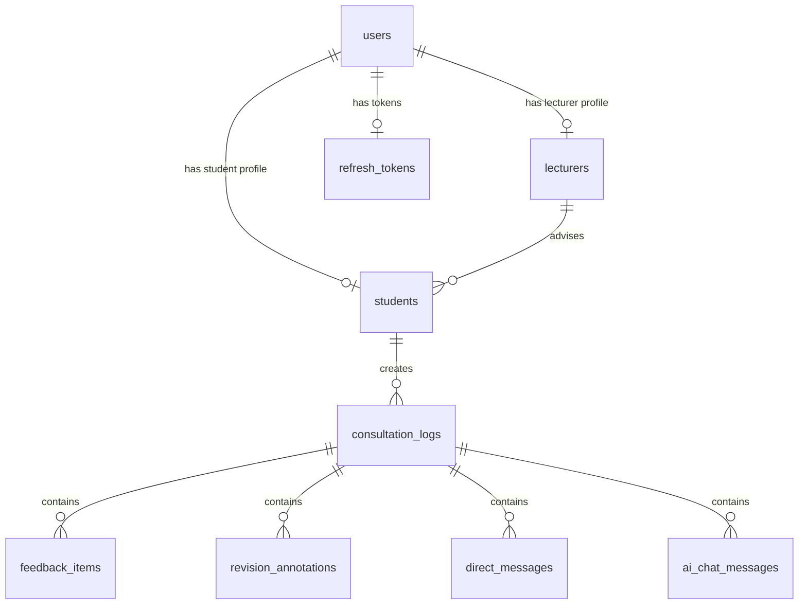
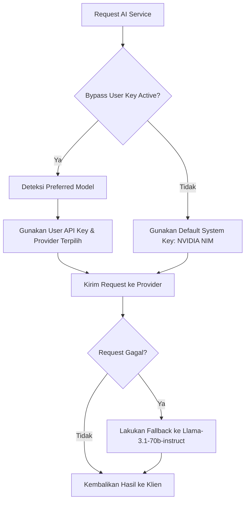
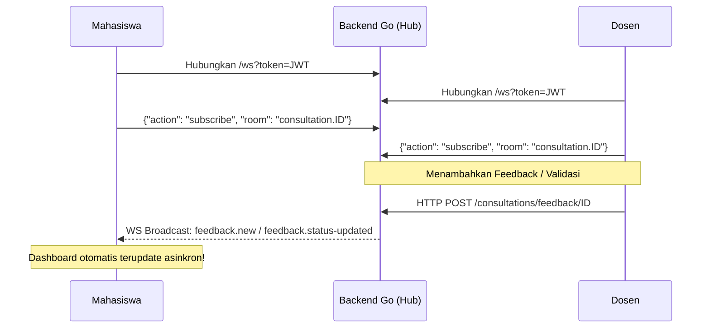

# TIERLOG RECONSTRUCTION BLUEPRINT
### Panduan Utama Pembangunan Ulang Aplikasi E-Logbook Bimbingan Akademik (TierLog)
**Tech Stack Baru:** Vue 3, Inertia.js, Laravel (Web Shell), Tailwind CSS, MySQL (Database), dan Go (AI & Real-Time Engine).

---

## 1. DAFTAR FITUR UTAMA & SPESIFIKASI DETIL

Aplikasi e-logbook akademik TierLog memisahkan kekhawatiran fungsional bimbingan antara Mahasiswa (unggah & tracking mandiri) dan Dosen (validasi & feedback terstruktur).

### A. Otomatisasi Transkripsi Audio Bimbingan (STT Engine)
*   **Fungsi Utama:** Mengonversi rekaman bimbingan verbal (`.mp3` atau `.wav`) menjadi teks transkrip mentah terstruktur untuk keperluan audit akademik.
*   **Mekanisme Transkripsi:**
    *   Mengunggah file audio melalui antarmuka dropzone.
    *   Jika ukuran file melebihi batas **20 MB**, sistem akan memecah file audio menjadi potongan byte (byte-chunks) $\le 20\text{ MB}$ untuk menghindari limitasi API payload.
    *   Setiap potongan dikirimkan ke model **Whisper-Large-v3** milik Groq API secara asinkron dengan parameter `language: "id"`.
    *   Hasil teks dari masing-masing potongan dijahit kembali secara linier sesuai urutan waktu bimbingan.

### B. Klasifikasi Revisi Berbasis AI (HOC vs. LOC)
*   **Fungsi Utama:** Menganalisis draf tulisan (`.docx`) dan teks transkrip suara bimbingan secara holistik untuk mengekstrak daftar tugas revisi mahasiswa secara otomatis.
*   **Skema Klasifikasi:**
    *   **HOC (Higher Order Concerns / Major Revisions):** Berfokus pada substansi fundamental akademik seperti inkonsistensi metodologi, struktur argumen, kekurangan literatur bab, dan kesesuaian judul.
    *   **LOC (Lower Order Concerns / Minor Revisions):** Berfokus pada detail teknis presentasi tulisan seperti kesalahan ketik (typo), format sitasi (APA/IEEE), tata bahasa (grammar), dan kerapian dokumen (justify).
*   **Alur Kerja Analisis:** Mengirimkan draf manuskrip, transkrip, dan riwayat revisi sebelumnya ke LLM via AI Gateway untuk menghasilkan output JSON terformat rapi berisi daftar tugas revisi berskala prioritas.

### C. Alur Kerja Rekonsiliasi & Validasi Revisi (Symmetric Verification)
*   **Fungsi Utama:** Mengelola daur hidup (lifecycle) setiap butir revisi secara transparan.
*   **Status Butir Revisi:**
    *   `Pending`: Ditambahkan oleh dosen (atau diekstrak oleh AI) dan menunggu pengerjaan mahasiswa.
    *   `Fixed`: Ditandai selesai oleh mahasiswa dengan melampirkan bukti revisi (opsional, berupa coretan dokumen JPG/PNG atau file `.docx` revisi).
    *   `Validated`: Disetujui secara resmi oleh Dosen Pembimbing melalui panel verifikasi waktu nyata.

### D. Asistensi Konsultasi AI Oracle
*   **Fungsi Utama:** Menyediakan chatbot akademik personal bagi mahasiswa untuk membedah instruksi revisi dari dosen pembimbing.
*   **Keamanan Konteks (Context Guardrails):**
    *   AI Oracle **dilarang keras** memberikan ide baru atau saran di luar lingkup transkrip bimbingan dan daftar feedback resmi dosen.
    *   Jika mahasiswa mengajukan pertanyaan di luar jalur pengerjaan, AI akan memicu instruksi penolakan asisten: *"Silakan bimbingan kembali dengan Dosen Pembimbing Anda untuk topik ini."*

---

## 2. ARSITEKTUR DATABASES (MYSQL SCHEMA)

Berdasarkan model relasional backend Go dan skema SQL, berikut adalah struktur tabel MySQL yang dinormalisasi untuk sistem TierLog.



### A. Tabel `users`
Menyimpan kredensial otentikasi utama dan pengaturan integrasi LLM personal.

| Nama Kolom | Tipe Data | Atribut | Keterangan |
| :--- | :--- | :--- | :--- |
| `id` | `BIGINT UNSIGNED` | `PRIMARY KEY`, `AUTO_INCREMENT` | ID unik pengguna |
| `email` | `VARCHAR(255)` | `UNIQUE`, `NOT NULL` | Alamat email institusi |
| `password` | `VARCHAR(255)` | `NOT NULL` | Hash password (BCrypt/Argon2) |
| `role` | `ENUM('student', 'lecturer')` | `NOT NULL` | Peran akses pengguna |
| `openai_key` | `VARCHAR(255)` | `NULL` | API Key OpenAI milik user |
| `gemini_key` | `VARCHAR(255)` | `NULL` | API Key Gemini milik user |
| `anthropic_key`| `VARCHAR(255)` | `NULL` | API Key Anthropic milik user |
| `nvidia_key` | `VARCHAR(255)` | `NULL` | API Key Nvidia NIM milik user |
| `preferred_model`| `VARCHAR(100)`| `DEFAULT 'default'` | Format provider:model (e.g. `gemini:gemini-2.0-flash`) |
| `is_gateway_active`| `TINYINT(1)` | `DEFAULT 0` | Mengaktifkan bypass key mandiri |
| `created_at` | `TIMESTAMP` | `NULL` | Catatan waktu pendaftaran |
| `updated_at` | `TIMESTAMP` | `NULL` | Catatan waktu modifikasi profil |
| `deleted_at` | `TIMESTAMP` | `NULL`, `INDEX` | Pendukung Soft Delete |

### B. Tabel `lecturers`
Menyimpan data identitas dosen pembimbing.

| Nama Kolom | Tipe Data | Atribut | Keterangan |
| :--- | :--- | :--- | :--- |
| `id` | `BIGINT UNSIGNED` | `PRIMARY KEY`, `AUTO_INCREMENT` | ID unik dosen |
| `user_id` | `BIGINT UNSIGNED` | `NOT NULL`, `FOREIGN KEY` | Relasi ke `users.id` (ON DELETE CASCADE) |
| `nip` | `VARCHAR(20)` | `UNIQUE`, `NOT NULL` | Nomor Induk Pegawai |
| `name` | `VARCHAR(100)` | `NOT NULL` | Nama lengkap + gelar |
| `keahlian` | `VARCHAR(100)` | `NULL` | Fokus kepakaran akademik |
| `faculty` | `VARCHAR(100)` | `NULL` | Nama fakultas asal |
| `created_at` | `TIMESTAMP` | `NULL` | Catatan waktu pembuatan |
| `updated_at` | `TIMESTAMP` | `NULL` | Catatan waktu pembaruan |

### C. Tabel `students`
Menyimpan profil mahasiswa beserta judul tesis pengerjaan.

| Nama Kolom | Tipe Data | Atribut | Keterangan |
| :--- | :--- | :--- | :--- |
| `id` | `BIGINT UNSIGNED` | `PRIMARY KEY`, `AUTO_INCREMENT` | ID unik mahasiswa |
| `user_id` | `BIGINT UNSIGNED` | `NOT NULL`, `FOREIGN KEY` | Relasi ke `users.id` (ON DELETE CASCADE) |
| `lecturer_id` | `BIGINT UNSIGNED` | `NOT NULL`, `FOREIGN KEY` | Relasi ke `lecturers.id` (ON DELETE RESTRICT) |
| `nim` | `VARCHAR(20)` | `UNIQUE`, `NOT NULL` | Nomor Induk Mahasiswa |
| `name` | `VARCHAR(100)` | `NOT NULL` | Nama lengkap mahasiswa |
| `prodi` | `VARCHAR(100)` | `NULL` | Program Studi |
| `thesis_title` | `TEXT` | `NULL` | Judul skripsi/tesis aktif |
| `created_at` | `TIMESTAMP` | `NULL` | Catatan waktu pembuatan |
| `updated_at` | `TIMESTAMP` | `NULL` | Catatan waktu pembaruan |

### D. Tabel `consultation_logs`
Representasi satu sesi pertemuan/bimbingan.

| Nama Kolom | Tipe Data | Atribut | Keterangan |
| :--- | :--- | :--- | :--- |
| `id` | `BIGINT UNSIGNED` | `PRIMARY KEY`, `AUTO_INCREMENT` | ID unik log bimbingan |
| `student_id` | `BIGINT UNSIGNED` | `NOT NULL`, `FOREIGN KEY` | Relasi ke `students.id` (ON DELETE CASCADE) |
| `audio_filename`| `VARCHAR(255)` | `NULL` | Lokasi path file rekaman bimbingan |
| `transcript_filename`| `VARCHAR(255)`| `NULL` | Lokasi path file transkripsi bimbingan |
| `transcript_text`| `LONGTEXT` | `NULL` | Output transkripsi teks hasil STT |
| `paper_filename`| `VARCHAR(255)` | `NULL` | Lokasi path draf tulisan `.docx` |
| `created_at` | `TIMESTAMP` | `NULL` | Waktu log dibuat |
| `updated_at` | `TIMESTAMP` | `NULL` | Waktu log diupdate |

### E. Tabel `feedback_items`
Butir-butir tugas revisi bimbingan akademik.

| Nama Kolom | Tipe Data | Atribut | Keterangan |
| :--- | :--- | :--- | :--- |
| `id` | `BIGINT UNSIGNED` | `PRIMARY KEY`, `AUTO_INCREMENT` | ID unik butir feedback |
| `log_id` | `BIGINT UNSIGNED` | `NOT NULL`, `FOREIGN KEY` | Relasi ke `consultation_logs.id` (ON DELETE CASCADE) |
| `content` | `TEXT` | `NOT NULL` | Konten instruksi revisi |
| `category` | `ENUM('Minor', 'Major')`| `NOT NULL` | Klasifikasi prioritas (`Minor` = LOC, `Major` = HOC) |
| `status` | `ENUM('Fixed', 'Pending', 'Validated')`| `NOT NULL`, `DEFAULT 'Pending'` | Lifecycle pengerjaan tugas revisi |
| `created_at` | `TIMESTAMP` | `NULL` | Catatan waktu pengerjaan |
| `updated_at` | `TIMESTAMP` | `NULL` | Catatan waktu pengerjaan |

### F. Tabel `revision_annotations`
Menyimpan anotasi revisi mahasiswa (gambar coretan halaman revisi/dokumen track changes).

| Nama Kolom | Tipe Data | Atribut | Keterangan |
| :--- | :--- | :--- | :--- |
| `id` | `BIGINT UNSIGNED` | `PRIMARY KEY`, `AUTO_INCREMENT` | ID unik anotasi revisi |
| `log_id` | `BIGINT UNSIGNED` | `NOT NULL`, `FOREIGN KEY` | Relasi ke `consultation_logs.id` (ON DELETE CASCADE) |
| `filename` | `VARCHAR(255)` | `NOT NULL` | Lokasi path file anotasi terunggah |
| `file_type` | `ENUM('image', 'docx')` | `NOT NULL` | Jenis berkas pendukung pembuktian |
| `extracted_text`| `LONGTEXT` | `NULL` | OCR teks terekstrak (opsional) |
| `created_at` | `TIMESTAMP` | `NULL` | Waktu unggah anotasi |
| `updated_at` | `TIMESTAMP` | `NULL` | Waktu update anotasi |

### G. Tabel `direct_messages` & `ai_chat_messages`
Menyimpan riwayat komunikasi antar personal dan asisten AI Oracle.

| Nama Kolom | Tipe Data | Atribut | Keterangan |
| :--- | :--- | :--- | :--- |
| `id` | `BIGINT UNSIGNED` | `PRIMARY KEY`, `AUTO_INCREMENT` | ID unik chat |
| `log_id` | `BIGINT UNSIGNED` | `NOT NULL`, `FOREIGN KEY` | Relasi ke `consultation_logs.id` (ON DELETE CASCADE) |
| `role` / `sender_role`| `VARCHAR(20)` | `NOT NULL` | `"user"`, `"ai"`, `"student"`, `"lecturer"` |
| `content` | `TEXT` | `NOT NULL` | Teks pesan chat |
| `created_at` | `TIMESTAMP` | `NULL` | Waktu kirim pesan |

---

## 3. ALUR KERJA SISTEM GATEWAY AI & PROMPTING ENGINE

TierLog memiliki arsitektur **AI Gateway** dinamis. Jika pengguna mengaktifkan `is_gateway_active` dan mengonfigurasi API Key mereka sendiri di panel pengaturan (`openai_key`, `gemini_key`, etc.), sistem akan melakukan bypass request langsung menggunakan kunci pengguna. Jika tidak, request akan diarahkan ke sistem fallback internal (NVIDIA NIM).



### A. Alur Kerja Gateway Pemilihan Provider (callAI)
Fungsi `callAI` melakukan pemetaan provider berdasarkan konfigurasi di database:
1.  **OpenAI:** Memanggil API endpoint `https://api.openai.com/v1/chat/completions` menggunakan model default `gpt-4o`.
2.  **Anthropic:** Memanggil API endpoint `https://api.anthropic.com/v1/messages` menggunakan model `claude-3-5-sonnet-20240620`.
3.  **Gemini:** Memanggil SDK resmi `google.golang.org/genai` dengan model `gemini-2.0-flash`.
4.  **NVIDIA NIM:** Memanggil endpoint server integrasi NVIDIA `https://integrate.api.nvidia.com/v1/chat/completions` menggunakan model `meta/llama-3.1-70b-instruct`.

### B. Prompt Konstruksi Klasifikasi Revisi (System Prompt)
Ketika audio STT selesai diproses, teks draf manuskrip dan transkrip bimbingan dikirimkan ke model AI untuk mengekstrak tugas akademik. Prompt ini diinjeksikan ke dalam parameter `SystemInstruction` atau `system` role:

```text
Kamu adalah Dosen Pembimbing yang teliti dan suportif. 
Tugasmu adalah menganalisis Draft Paper Mahasiswa berdasarkan Transkrip Bimbingan (Instruksi Dosen).

PRINSIP UTAMA:
1. Dilarang berhalusinasi atau memberikan ide baru yang tidak ada di transkrip.
2. Instruksi 100% berasal dari teks transkrip rekaman.
3. Bandingkan draf mahasiswa dengan poin-poin dalam transkrip.
4. Hasilkan daftar tugas revisi yang spesifik.

KATEGORI FEEDBACK:
- HOC (Higher Order Concerns): Fokus pada substansi seperti struktur, argumen, metodologi, dan kesesuaian judul.
- LOC (Lower Order Concerns): Fokus pada teknis seperti penulisan, typo, format sitasi, dan tata bahasa.

TATA CARA OUTPUT:
Kamu WAJIB mengembalikan output dalam format JSON dengan struktur:
{
  "feedbacks": [
    {"content": "Isi instruksi revisi...", "category": "HOC"},
    {"content": "Isi instruksi revisi...", "category": "LOC"}
  ]
}
```

### C. Mekanisme Parser JSON Bulletproof (Backend Go)
Untuk mengantisipasi LLM yang mengembalikan markup markdown tambahan (seperti ` ```json `), parser backend Go mengimplementasikan **Waterfall Extraction**:
1.  **Direct Unmarshal:** Mencoba melakukan JSON parsing mentah ke struct.
2.  **Boundary Trimming:** Jika gagal, sistem memotong spasi depan/belakang serta mendeteksi substring ` ```json ` dan ` ``` ` untuk memotong kode blok.
3.  **Index Brackets Extraction:** Jika masih gagal, sistem memindai indeks `{` pertama dan `}` terakhir dalam string respon, memotong sisa karakter pembungkus percakapan, lalu melakukan unmarshal ulang.

---

## 4. SISTEM KOMUNIKASI REALTIME (WEBSOCKET ENGINE)

Untuk mencapai pengalaman koordinasi bimbingan tanpa muat ulang (no-refresh), backend Go mengimplementasikan arsitektur **Pub/Sub Hub** menggunakan koneksi persisten WebSocket.



### A. Protokol Pertukaran Data Klien (Websocket Frame)
Komunikasi real-time dikelola lewat payload bertipe JSON.

#### 1. Frame Subscribe Ruangan (Client &rarr; Server)
Dikirim oleh klien (mahasiswa/dosen) segera setelah handshaking WebSocket terbuka untuk membatasi ruang lingkup notifikasi ke log bimbingan mereka.
```json
{
  "action": "subscribe",
  "room": "consultation.14"
}
```

#### 2. Frame Broadcast Event Baru (Server &rarr; Client)
Dikirim oleh server asinkron saat ada aktivitas baru di database.
*   **Event `feedback.new`:**
    ```json
    {
      "event": "feedback.new",
      "room": "consultation.14",
      "data": {
        "id": 102,
        "log_id": 14,
        "content": "Gunakan perataan rata kanan-kiri (justify) di setiap paragraf Bab 3.",
        "category": "Minor",
        "status": "Pending",
        "created_at": "2026-06-01T15:00:00.000Z"
      }
    }
    ```
*   **Event `feedback.status-updated`:**
    ```json
    {
      "event": "feedback.status-updated",
      "room": "consultation.14",
      "data": {
        "id": 102,
        "status": "Validated"
      }
    }
    ```

### B. Arsitektur Hub di Backend Go
*   **`Client` Struct:** Menyimpan pointer koneksi `*websocket.Conn`, data user `*models.User`, mutex untuk penulisan aman, dan map ruangan (`rooms`) yang sedang aktif didengarkan.
*   **`Hub` Struct:** Mengelola relasi penyiaran menggunakan peta `rooms map[string]map[*Client]bool` dengan proteksi read-write mutex (`sync.RWMutex`).
*   **`Broadcast` Function:** Melakukan iterasi di luar thread utama (`go`) ke semua klien terdaftar dalam ruangan target. Jika penulisan ke klien gagal, koneksi akan diputuskan secara anggun (`disconnect`).

---

## 5. PANDUAN KONVERSI ANTARMUKA (KNOWLEDGE CONSTELLATION KE VUE 3)

Komponen interaktif **Knowledge Constellation** merupakan modul visualisasi sains 3D berbasis WebGL. Di bawah ini adalah panduan migrasi modul interaktif ini ke dalam template Vue 3 menggunakan kombinasi **SVG dinamis** (fallback performa tinggi untuk kelancaran rendering) dan utility utility **Tailwind CSS**.

### A. Struktur Kode Komponen Vue 3 (`KnowledgeConstellation.vue`)

```vue
<template>
  <div class="relative w-full h-[560px] rounded-3xl overflow-hidden bg-[#080B15] border border-slate-800 shadow-2xl">
    
    <!-- SVG Constellation Layer -->
    <svg class="absolute inset-0 w-full h-full" :viewBox="`0 0 ${svgWidth} ${svgHeight}`">
      <defs>
        <radialGradient id="glowGrad" cx="50%" cy="50%" r="50%">
          <stop offset="0%" stop-color="#3B82F6" stop-opacity="0.15" />
          <stop offset="100%" stop-color="#3B82F6" stop-opacity="0" />
        </radialGradient>
      </defs>

      <!-- Soft center glow -->
      <circle :cx="svgWidth / 2" :cy="svgHeight / 2" :r="svgHeight * 0.45" fill="url(#glowGrad)" />

      <!-- Constellation Grid Lines -->
      <line
        v-for="(connection, idx) in connections"
        :key="`line-${idx}`"
        :x1="getNodeCoords(connection[0]).x"
        :y1="getNodeCoords(connection[0]).y"
        :x2="getNodeCoords(connection[1]).x"
        :y2="getNodeCoords(connection[1]).y"
        stroke="#6366F1"
        stroke-width="1"
        stroke-opacity="0.25"
        stroke-dasharray="4 4"
      />

      <!-- Node Circles & Concentric Rings -->
      <g
        v-for="node in mappedNodes"
        :key="node.id"
        class="cursor-pointer"
        @mouseenter="hoveredNodeId = node.id"
        @mouseleave="hoveredNodeId = null"
      >
        <!-- Telemetry Spin Ring 1 (Cyber Teal) -->
        <circle
          v-if="hoveredNodeId === node.id"
          :cx="node.x"
          :cy="node.y"
          r="22"
          fill="none"
          stroke="#14B8A6"
          stroke-width="1"
          stroke-opacity="0.75"
          class="animate-[spin_4s_linear_infinite]"
        />
        
        <!-- Telemetry Spin Ring 2 (Indigo) -->
        <circle
          v-if="hoveredNodeId === node.id"
          :cx="node.x"
          :cy="node.y"
          r="28"
          fill="none"
          stroke="#6366F1"
          stroke-width="1"
          stroke-opacity="0.4"
          stroke-dasharray="6 2"
          class="animate-[spin_10s_linear_infinite_reverse]"
        />

        <!-- Glowing Hover Buffer -->
        <circle
          :cx="node.x"
          :cy="node.y"
          :r="hoveredNodeId === node.id ? 22 : 12"
          :fill="node.color"
          fill-opacity="0.08"
          class="transition-all duration-300 ease-out"
        />

        <!-- Core Coordinate Dot -->
        <circle
          :cx="node.x"
          :cy="node.y"
          :r="hoveredNodeId === node.id ? 7 : 5"
          :fill="node.color"
          class="transition-all duration-300 ease-out"
        />

        <!-- Coordinate HUD overlay text -->
        <text
          v-if="hoveredNodeId === node.id"
          :x="node.x + 16"
          :y="node.y - 8"
          fill="#6366F1"
          class="text-[8px] font-mono font-bold select-none fill-indigo-400"
        >
          [{{ node.position[0].toFixed(1) }}, {{ node.position[1].toFixed(1) }}]
        </text>
      </g>
    </svg>

    <!-- Bottom HUD Console (Glassmorphism UI) -->
    <div class="absolute bottom-4 left-4 right-4 z-10 pointer-events-none">
      <div 
        class="bg-[#0a0f1e]/90 border border-slate-700/50 rounded-2xl p-4 backdrop-blur-md transition-all duration-300 gap-1 pointer-events-auto"
        :class="{ 'border-indigo-500/40 shadow-indigo-500/5 shadow-lg': activeNode }"
      >
        <div class="flex items-center gap-2 mb-1">
          <span class="w-1.5 h-1.5 rounded-full bg-emerald-500 animate-ping shadow-[0_0_8px_#10B981]"></span>
          <span class="text-[9px] font-mono font-black text-slate-400 tracking-widest uppercase">
            {{ activeNode ? `TELEMETRY NODE 0${activeNode.id} CONNECTED` : "ACADEMIC CONSOLE::SYSTEM_ONLINE" }}
          </span>
        </div>

        <h4 class="text-sm font-bold text-slate-100 tracking-tight">
          {{ activeNode ? activeNode.name : "Academic Progress Graph Structure" }}
        </h4>
        
        <p class="text-[10px] font-bold text-slate-500 uppercase tracking-wider">
          {{ activeNode ? activeNode.tag : "Hover over coordinates to retrieve active draft parameters" }}
        </p>

        <!-- Detailed view when hovering -->
        <div v-if="activeNode" class="mt-3 pt-3 border-t border-slate-800/80 flex flex-col gap-2">
          <p class="text-xs text-slate-300 leading-relaxed font-medium">
            {{ activeNode.description }}
          </p>
          <div class="flex justify-between items-center text-[10px] font-mono text-slate-500 pt-2 border-t border-slate-900/50">
            <span>COORDINATE: <span class="text-teal-400 font-bold">[{{ activeNode.position.join(', ') }}]</span></span>
            <span>WEIGHT_VAL: <span class="text-teal-400 font-bold">{{ ((activeNode.id * 1.618) + 2.14).toFixed(3) }}</span></span>
          </div>
        </div>

        <!-- Inline quick selectors when empty -->
        <div v-else class="flex flex-wrap gap-1.5 mt-3 pt-3 border-t border-slate-800/80">
          <button
            v-for="n in nodes"
            :key="n.id"
            class="text-[9px] font-bold text-slate-400 border border-slate-800 px-2 py-1 rounded bg-slate-900/40 hover:bg-slate-800 hover:text-slate-200 transition-all duration-200"
            @mouseenter="hoveredNodeId = n.id"
            @mouseleave="hoveredNodeId = null"
          >
            Node 0{{ n.id }}
          </button>
        </div>
      </div>
    </div>
  </div>
</template>

<script setup>
import { ref, computed } from 'vue';

const svgWidth = 500;
const svgHeight = 480;

const hoveredNodeId = ref(null);

const nodes = [
  { id: 1, position: [-2.2, 1.2, 0], color: '#3B82F6', name: 'PROP-101: AI Oracle Academic Copilot', tag: 'NVIDIA NIM POWERED CONTEXT COGNITION', description: 'Generates precise, contextual solutions and revision guidance directly from your advisor\'s feedback using personal API keys.' },
  { id: 2, position: [-1.0, -1.2, 0.8], color: '#0F766E', name: 'CHAT-204: Real-Time Advisory Chat', tag: 'SECURE PEER-TO-PEER WEBSOCKET SYNCHRONIZATION', description: 'Facilitates immediate, persistent text discussions and live sync checkpoints between students and their advisors.' },
  { id: 3, position: [0.8, 1.6, -0.5], color: '#6366F1', name: 'STT-309: High-Fidelity Audio Transcription', tag: 'INTELLIGENT SPEECH-TO-TEXT DIALOGUE ENGINE', description: 'Converts raw advisory audio recordings into structured, search-ready text transcripts for immediate academic auditing.' },
  { id: 4, position: [2.2, -0.4, 0.5], color: '#3B82F6', name: 'VAL-402: Contextual Revision Validation', tag: 'BIDIRECTIONAL STATUS RESOLUTION SYSTEM', description: 'Symmetric validation workflow where students submit fixes and advisors validate or revoke approvals instantly.' },
  { id: 5, position: [0.4, -1.8, -0.8], color: '#0F766E', name: 'ARC-510: Document Version Archive', tag: 'SECURE DRAFT STORAGE & ANNOTATION LOGS', description: 'Stores complete historical records of thesis drafts, uploaded manuscripts, and annotated adviser feedback pages.' },
  { id: 6, position: [-0.6, 0.2, -1.8], color: '#6366F1', name: 'MET-612: Hyper-Minimalist Analytics', tag: 'INTEGRATED COMPLETION RATE STATISTICS', description: 'Aggregates active revisions, completion velocity, and pending validation items into an executive-grade dashboard.' }
];

const connections = [
  [1, 2], [1, 3], [1, 6],
  [2, 4], [2, 5],
  [3, 4], [3, 6],
  [4, 5],
  [5, 6]
];

// Project 3D coordinate space to 2D SVG canvas coordinate space
const mappedNodes = computed(() => {
  return nodes.map((node) => {
    const x = ((node.position[0] + 2.6) / 5.2) * (svgWidth - 120) + 60;
    const y = ((-node.position[1] + 2.2) / 4.4) * (svgHeight - 180) + 50;
    return { ...node, x, y };
  });
});

const activeNode = computed(() => {
  return nodes.find((n) => n.id === hoveredNodeId.value) || null;
});

function getNodeCoords(id) {
  const node = mappedNodes.value.find((n) => n.id === id);
  return node ? { x: node.x, y: node.y } : { x: 0, y: 0 };
}
</script>
```

---

## 6. DAFTAR ENDPOINT API BACKEND GO YANG WAJIB DIPERTAHANKAN

Untuk mendukung kelancaran pemisahan antarmuka (frontend Vue) dan logika asisten cerdas (backend Go), berikut adalah daftar rute API yang wajib dijaga fungsionalitasnya di Go.

> [!IMPORTANT]
> Seluruh rute API dilindungi oleh middleware otentikasi JWT (`middleware.AuthRequired()`), yang membaca Bearer Token pada HTTP Header `Authorization`.

### A. Endpoint Otentikasi & Pengaturan
1.  **`POST /auth/register`**
    *   **Deskripsi:** Pendaftaran akun baru Mahasiswa atau Dosen.
2.  **`POST /auth/login`**
    *   **Deskripsi:** Otentikasi login pengguna. Menghasilkan JWT token.
3.  **`GET /auth/me`**
    *   **Deskripsi:** Memvalidasi JWT token dan mengambil profil pengguna saat ini.
4.  **`PATCH /settings/ai-gateway`**
    *   **Deskripsi:** Memperbarui parameter API Key LLM personal (`openai_key`, `gemini_key`, `nvidia_key`, dll).

### B. Endpoint Transkripsi & Klasifikasi AI
5.  **`POST /consultations`**
    *   **Deskripsi:** Membuat sesi bimbingan logbook baru dengan mengunggah audio rekaman (`.mp3`/`.wav`) dan/atau manuskrip draf skripsi (`.docx`).
    *   **Proses Backend:** Memicu Groq Whisper STT + LLM HOC/LOC Analysis.
6.  **`POST /consultations/:id/classify-feedback`**
    *   **Deskripsi:** Menjalankan ulang parser AI klasifikasi revisi pada log konsultasi berdasarkan transkrip bimbingan.

### C. Endpoint Chat & AI Oracle
7.  **`GET /consultations/:id/direct-messages`**
    *   **Deskripsi:** Mengambil riwayat pesan obrolan langsung (direct chat) antara Dosen dan Mahasiswa pada sesi bimbingan tertentu.
8.  **`POST /consultations/:id/direct-messages`**
    *   **Deskripsi:** Mengirim pesan chat baru dan memicu push broadcast WebSocket.
9.  **`GET /consultations/:id/ai-chats`**
    *   **Deskripsi:** Mengambil riwayat percakapan asisten AI Oracle.
10. **`POST /consultations/chat`**
    *   **Deskripsi:** Mengirim pertanyaan mahasiswa ke AI Oracle mengenai instruksi revisi dosen (Guarded Context).

### D. Endpoint Validasi & Kontrol Dosen
11. **`GET /lecturer/consultations`**
    *   **Deskripsi:** Mengambil semua daftar bimbingan mahasiswa di bawah supervisi dosen tersebut.
12. **`POST /consultations/:id/add-feedback`**
    *   **Deskripsi:** Dosen mengirimkan butir revisi secara manual ke mahasiswa.
13. **`PUT /consultations/feedback/:id/status`**
    *   **Deskripsi:** Memperbarui status revisi dari `Pending` &rarr; `Fixed` (oleh mahasiswa) atau `Fixed` &rarr; `Validated` (oleh dosen).
